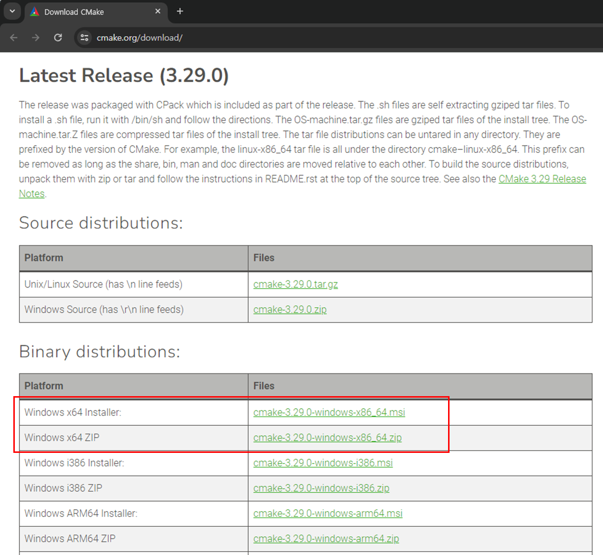

# AVR setting for Windows

## 설치 프로그램

### 1. CMake

[**https://cmake.org/download/**](https://cmake.org/download/)



- **윈도우즈 인스톨러 또는 압축 파일을 다운로드 한다**
- **압축파일을 다운로드 하였으면 시스템패스에 등록하여 언제든지 실행 가능하도록 해야 한다**

---

---

- **시스템 환경변수 등록**


- **고급탭에서 → 하단의 환경변수 클릭**


- **하단의 시스템변수 에서**
- **Path 선택 → 편집 클릭**


- **-새로 만들기 클릭 → 하단에 빈칸이 생**


---

---

### 2. AVR-GCC 컴파일러

[**https://www.microchip.com/en-us/tools-resources/develop/microchip-studio/gcc-compilers**](https://www.microchip.com/en-us/tools-resources/develop/microchip-studio/gcc-compilers)


- **위에 사이트에서 윈도우용 AVR 8-bit 툴체인은 다운로드 한다**
- **원하는 폴더에 압축을 해제 한다**

### **3. make**

[**https://github.com/xpack-dev-tools/windows-build-tools-xpack/releases/**](https://github.com/xpack-dev-tools/windows-build-tools-xpack/releases/)


- **위에 사이트에서 xpack-windows-build-tools-4.4.1-2-win32-x64.zip 파일을 다운로드 한다**
- **make 는 소스 파일을 빌드하는 도구로서 CMake를 사용하여 생성하고 make를 이용하여 실제 빌드를 한다**

### 4. avrdude 다운로더 프로그램

[**https://github.com/avrdudes/avrdude/releases**](https://github.com/avrdudes/avrdude/releases)


- **위의 사이트에서 avrdude-v7.3-windows-x64.zip 를 다운로드 하여 압축을 해제 한다**
- **추후에 avrdude 라는 폴더이름으로 변경후에 프로젝트 폴더로 복사하여 사용할 예정이다**

---

---

## Visual Studio Code 확장 모듈 설치

### 1. C/C++


### 2. CMake


### 3. CMake Tools


---

---

## Workspace 만들기

### 1. 작업할 영역인 폴더 하나를 생성한다


- **Visual Studio Code는 여러개의 폴더를 관리할 수 있는 Workspace가 있다**
- **한개의 파일로 여러개의 폴더를 하나의 Workspace안에서 관리가 가능하다**

### **2. File → Save Workspace As…  를 선택한다**


- **avr.code-workspace 로 저장 한다**


### 3. 프로젝트 만들기

- **펌웨어용(사용할 MCU) 폴더를 하나 생성한다**


- **File → Add Folder to Workspace 를 선택하여 위에서 생성한 폴더를 선택한다**


- **아래와 같이 나오면 Yes 클릭**


- 워크스페이스에 폴더가 추가된것이 보인다


---

## 1. CMake Tools 설정

- **Visual Studio Code의 확장모듈 중에 CMake Tools를 선택하고 톱니바퀴를 누르면 나오는 메뉴중에 Extension Settings를 선택**


- **설정값을 어느범위로 할 것이냐를 선택해야 하는데 User를 선택하면 항상 적용이 되고, Workspace를 적용하면 현재 Open한 워크스페이스에 저장이 되어서 워크스페이스별로 설정을 달리 하고자 할때는 Workspace로 설정합니다.**
- **저는 Workspace를 선택했다**


### **2. Cmake: Configure Args → 오른쪽을 아래쪽으로 스크롤 하면 나타남**

- **옵션 중에 Configure Args를 아래 2개의 정의값을 추가한다.**
- **AVR_TOOLCHAIN_DIR은 이전에 다운로드 받은 AVR GCC 컴파일러의 실행파일 위치이고**
- **CMAKE_MAKE_PROGRAM은 make 실행파일의 위치입니다.**
- **주의 할 것은 폴더의 슬래시문자를 리눅스에서 사용하는 슬래시로 입력해야 합니다. 윈도우타입인 역슬래시를 입력하면 안됩니다.**

```c
**-DAVR_TOOLCHAIN_DIR=G:/avr_toolchain/avr
-DCMAKE_MAKE_PROGRAM=G:/avr_toolchain/make/bin/make.exe**
```


### 3. **Cmake: Generator**

- **빌드프로그램을 make를 사용하기 때문에 Generator 옵션에 Unix Makefiles로 입력을 합니다.**


### 4. Toolchain Kit 설정

- **이제는 빌드를 위한 Toolchain Kit을 설정해야 합니다.**
- **먼저 펌웨어 폴더 아래에 tools 폴더를 생성합니다.**


- **tools 폴더 밑에 avr-gcc.cmake 파일을 생성하고 아래 내용입력**
- **아래 내용은 어떤 컴파일러를 사용하는지와 그것에 대한 설정이 있음**


```c
**set(CMAKE_SYSTEM_NAME Generic)
set(CMAKE_SYSTEM_PROCESSOR AVR)

set(BINUTILS_PATH ${AVR_TOOLCHAIN_DIR})

set(TOOLCHAIN_PREFIX ${AVR_TOOLCHAIN_DIR}/bin/avr-)

set(CMAKE_TRY_COMPILE_TARGET_TYPE STATIC_LIBRARY)

set(CMAKE_C_COMPILER "${TOOLCHAIN_PREFIX}gcc.exe" CACHE FILEPATH "C Compiler path")
set(CMAKE_ASM_COMPILER ${CMAKE_C_COMPILER})
set(CMAKE_CXX_COMPILER "${TOOLCHAIN_PREFIX}g++.exe" CACHE FILEPATH "C++ Compiler path")

set(CMAKE_OBJCOPY ${TOOLCHAIN_PREFIX}objcopy CACHE INTERNAL "objcopy tool")
set(CMAKE_SIZE_UTIL ${TOOLCHAIN_PREFIX}size CACHE INTERNAL "size tool")

set(CMAKE_C_STANDARD    11)
set(CMAKE_CXX_STANDARD  11)

# Disable compiler checks.
set(CMAKE_C_COMPILER_FORCED TRUE)
set(CMAKE_CXX_COMPILER_FORCED TRUE)

set(CMAKE_FIND_ROOT_PATH ${BINUTILS_PATH})
set(CMAKE_FIND_ROOT_PATH_MODE_PROGRAM NEVER)
set(CMAKE_FIND_ROOT_PATH_MODE_LIBRARY ONLY)
set(CMAKE_FIND_ROOT_PATH_MODE_INCLUDE ONLY)
set(CMAKE_FIND_ROOT_PATH_MODE_PACKAGE ONLY)**
```

- **Toolchain Kit 설정파일을 만들기 위해서 atmega128a_fw폴터 밑에 .vscode 폴더를 생성하고**
- **그 아래에 cmake-kits.json 이름으로 새로운 파일을 생성합니다.**
- 


- **cmake-kits.json 에 아래의 내용을 입력한다**

```c
**[
  {
      "name": "AVR-GCC Embedded",
      "toolchainFile": "${workspaceFolder}/tools/avr-gcc.cmake"
  }
]**
```

### 5. **CMake Configuration**

- **CMake Configuration을 실행하면 CMakeLists.txt 파일이 생성이 되고 기본적인 main.cpp 파일이 생성이 됩니다.**
- **F1 키를 누르고 CMake: Configure를 선택합니다.**


- **Select a Kit 메뉴가 나오면 이전에 추가했던 AVR-GCC 툴킷을 선택합니다.**


- **프로젝트 이름을 넣어준다**


- **C 언어 프로젝트를 선택한다**


- **실행 파일로 만들어야 하기 때문에 Executable 선택한다**


- **여기까지 진행하면 아래 그림처럼 main.c 와 CMakeList.txt가 생성된다**


- **main.c 파일을 아래와 같이 변경한다**


- **다시 F1을 눌러 CMake:Configure를 실행한다**


- **이번에 실행을 하면 Toolchain Kit과 CMakeLists.txt 기반으로 빌드환경이 만들어 지게 됩니다.**


- **build 폴더가 생성되고 이곳에 빌드와 관련된 파일들이 생성된 것을  볼수 있다**


### 6. 빌드하기

- **이제 빌드 환경은 다 만들어 졌고 실제로 빌드를 한번 해보자**
- **F1을 눌러서 CMake: Build를 실행하거나 하단의 Build 아이콘을 누르면 빌드가 진행된다.**


- **빌드가 성공적으로 되었다…**


- **CMakeList.txt 파일을 아래 내용으로 수정한다**
- **아래 CMakeList에는 컴파일/링커 옵션과 hex파일을 생성하는 부분까지 추가되어 있다**

```c
**cmake_minimum_required(VERSION 3.5.0)

project(atmega128a_fw 
  LANGUAGES ASM C CXX
)

set(EXECUTABLE ${PROJECT_NAME}.elf)

# 해당 폴더의 파일만 찾는다.
file(GLOB SRC_FILES CONFIGURE_DEPENDS
  *.c
  *.cpp
)

# 해당 폴더를 포함해서 하위 폴더까지의 파일도 찾는다.
file(GLOB_RECURSE SRC_FILES_RECURSE CONFIGURE_DEPENDS
  src/*.c
  src/*.cpp
)

# Build the executable based on the source files
add_executable(${EXECUTABLE}  
  ${SRC_FILES}
  ${SRC_FILES_RECURSE}
  )

target_compile_definitions(${EXECUTABLE} PRIVATE
  -DF_CPU=16000000L
  )

# List of includ directories
target_include_directories(${EXECUTABLE} PRIVATE
  src 
  src/ap
  src/bsp
  src/hw
  src/common
  src/common/hw/include
  )

# Compiler options
target_compile_options(${EXECUTABLE} PRIVATE
  -mmcu=atmega128a
  
  -fdata-sections
  -ffunction-sections
  -MMD
  -flto
  -fno-fat-lto-objects

  -Wall
  -Os
  -g3
  )

# Linker options
target_link_options(${EXECUTABLE} PRIVATE
  -mmcu=atmega128a
  
  -flto 
  -fuse-linker-plugin

  -lm
  -Wl,-Map=${PROJECT_NAME}.map,--cref
  -Wl,--gc-sections
  -Xlinker -print-memory-usage -Xlinker
  )

add_custom_command(TARGET ${EXECUTABLE} 
  POST_BUILD
  COMMAND ${CMAKE_OBJCOPY} ARGS -O ihex -R .eeprom ${EXECUTABLE} ${PROJECT_NAME}.hex
  COMMENT "Invoking: Make Hex"
  )  

add_custom_command(TARGET ${EXECUTABLE} 
  POST_BUILD
  COMMAND ${CMAKE_OBJCOPY} ARGS -O ihex -j .eeprom --set-section-flags=.eeprom=alloc,load --no-change-warnings --change-section-lma .eeprom=0 ${EXECUTABLE} ${PROJECT_NAME}.eep
  COMMENT "Invoking: Make EEPROM"
  )**   
```

- **다시 빌드를 하면 이제는 펌웨어 섹션별로 용량이 표시되고 Invoking: Make Hex가 표시되면서 hex파일도 생성되는 것을 볼 수 있다**


### 7. 다운로드 하기

- **펌웨어를 다운로드 하기 위해서 펌웨어 hex 파일은 준비가 되었고 다운로드를 하기 위한 프로그램인 avrdude가 필요하다**
- **이전에 다운로드한 프로그램을 압축을 해제해서 tools 폴더에 복사를 한다(탐색기에서 좌클릭으로 끌고 간다)**
- **아래 그림은 tools 폴더에 복사를 한 모습이다**


- **Terminal->Configure Tasks를 실행한다**
- **Tasks는 이클립스에서 External Tools와 비슷한 기능으로 외부의 프로그램을 연결해서 실행 할 수 있는 기능이다**


- **Create tasks.json file from template를 선택한다**


- **그 다음에 나오는 템플릿에서 Others를 선택합니다.**


- **아래 그림처럼 .vscode 폴더에 tasks.json 파일이 생성되고 기본적인 템플릿 내용이 보입니다.**


- **아래 내용으로 변경한다**
- **여기서 -PCOM3 은 PC에 연결된 보드의 시리얼 포트 번호를 입력하면 된다**

```c
**{
    // See https://go.microsoft.com/fwlink/?LinkId=733558
    // for the documentation about the tasks.json format
    "version": "2.0.0",
    "tasks": [
        {
            "label": "avrdude",
            "type": "shell",
            "command": "tools/avrdude/avrdude.exe -C./tools/avrdude/avrdude.conf -v -patmega128a -cwiring -PCOM3 -b115200 -e -D -Uflash:w:build/atmega128a_fw.hex:i"
        }
    ]
}**
```

- **이런식으로 정리 가능**

```c
**{
    "version": "2.0.0",
    "tasks": [
        {
            "label": "avrdude",
            "type": "shell",
            "command": "E:/avr_tools/avrdude/avrdude.exe",
            "args": [
                "-C", "E:/avr_tools/avrdude/avrdude.conf",
                "-v",
                "-p", "atmega328p",
                "-c", "arduino",
                "-P", "COM5",
                "-b", "115200",
                "-e",
                "-D",
                "-U", "flash:w:build/atmega328p.hex:i"
            ],
            "problemMatcher": []
        }
    ]
}**

```

- **보드를 PC와 연결하고 Terminal->Run Task를 선택한다**


- **avrdude를 선택한다**


- **정상적으로 다운로드가 되는 것을 볼 수 있다**


- 완료

